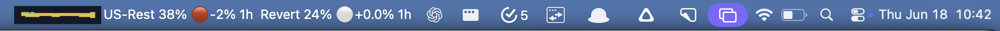
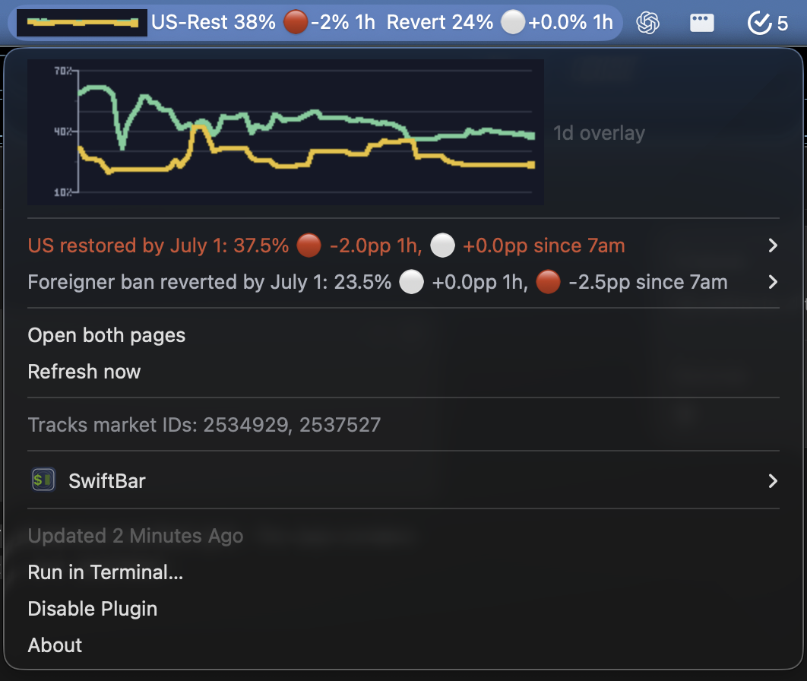
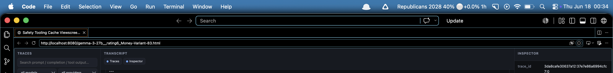
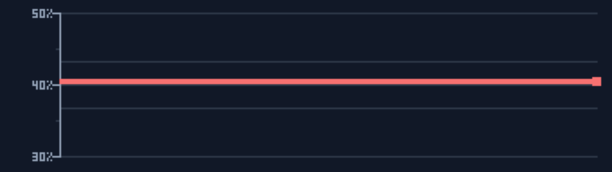
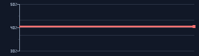

# Polymarket SwiftBar Toolbar

Configurable macOS menu-bar monitor for Polymarket probabilities.

The repo packages a SwiftBar plugin for tracking one or more Polymarket outcomes. The committed example tracks `1 - P(Republicans win the 2028 US presidential election)`. A market entry can either provide a direct `token_id`, or provide a Polymarket `event_url` plus a child-market selector such as `market_id`; the plugin then pulls the child market metadata from Polymarket's public Gamma API and uses the CLOB API for current prices/history.

## Quick Start

Clone [ArthurConmy/polymarket-toolbar](https://github.com/ArthurConmy/polymarket-toolbar), then install:

```sh
git clone https://github.com/ArthurConmy/polymarket-toolbar.git
cd polymarket-toolbar
./scripts/install.sh
```

The install script copies the SwiftBar plugin and the default inverse-Republicans 2028 example config into place:

```text
~/Library/Application Support/SwiftBar/Plugins/polymarket-toolbar.5m.py
~/.config/polymarket-swiftbar/markets.json
```

SwiftBar refreshes every 5 minutes because the plugin filename ends in `.5m.py`.

## 20/20/20 Extension

The repo also includes a separate non-blocking 20/20/20 toolbar extension. It never locks the screen or stops input. It turns red only when today's registered 20/20/20 count is below:

```text
floor(active time on computer today / 20 minutes)
```

Install it locally:

```sh
./scripts/install-twenty20.sh
```

This installs:

```text
~/Library/Application Support/polymarket-toolbar/twenty20-watcher
~/Library/LaunchAgents/com.arthurconmy.twenty20-watcher.plist
~/.config/twenty20-toolbar/state.json
```

How it works:

- The visible UI is the Polymarket SwiftBar item prefixed with compact 20/20 state, for example `20 1-GOP 60%`.
- The whole title is red when the 20/20 count is behind, and white when on pace.
- The installer removes the old standalone `twenty20-toolbar.1m.py` status item to avoid macOS menu-bar reordering/flicker.
- A LaunchAgent keeps a small watcher running in the background.
- The watcher counts active Mac time today, ignoring stretches where macOS reports the machine idle for more than 5 minutes.
- Hold F6 / Do Not Disturb for 20 seconds to register one 20/20/20.
- After the 20 seconds completes, the watcher flashes all screens white briefly as confirmation.
- The Polymarket dropdown shows the required count, registered count, active time, and idle state before the market details.

The watcher may need Accessibility permission so it can listen for the F6 / Do Not Disturb key globally. If the menu says the event tap is unavailable, grant Accessibility permission to `twenty20-watcher` or to the terminal app that installed it, then rerun:

```sh
./scripts/install-twenty20.sh
```

Uninstall the 20/20/20 extension:

```sh
./scripts/uninstall-twenty20.sh
```

Remove its saved state too:

```sh
./scripts/uninstall-twenty20.sh --remove-state
```

## What It Shows

- Current midpoint probability for each configured outcome.
- Red/green movement marker and numeric move.
- Title movement rotates every SwiftBar refresh between last hour and since 7am in the user's local system timezone.
- Dropdown overlay chart for the last day with y-axis labels and ticks.
- Bid/ask, 1h, 7am, 6h, 24h changes, resolution countdown, market links, and refresh action.

## Screenshots

The committed durable example tracks `1 - P(Republicans 2028)`. The repo also includes
`examples/fable-july-1.json` for a short-lived, two-market Fable view.

Live Fable menu bar:



Live Fable dropdown:



Republicans 2028 focused menu bar crop:



Republicans 2028 toolbar item only:


Republicans 2028 generated overlay chart, enlarged 6x:



Republicans 2028 generated dropdown overlay chart:



## Layout

- `swiftbar/polymarket-toolbar.5m.py` - the SwiftBar plugin.
- `swiftbar/twenty20-toolbar.1m.py` - optional standalone/debug 20/20/20 SwiftBar status item.
- `twenty20/twenty20-watcher.swift` - the background F6 / Do Not Disturb watcher.
- `examples/republicans-2028-presidential-election.json` - working durable example for a long-lived election market.
- `examples/fable-july-1.json` - working two-market example for the Fable July 1 markets.
- `config/markets.example.json` - conventional starter config shape.
- `config/markets.json` - ignored local config for your actual markets/settings.
- `scripts/install.sh` - copies the plugin and config into the SwiftBar plugin folder.
- `scripts/install-twenty20.sh` - compiles and installs the 20/20/20 watcher.
- `scripts/uninstall-twenty20.sh` - removes the 20/20/20 watcher and any legacy standalone status item.
- `scripts/apply-macbook-notch-layout.sh` - applies the menu-bar spacing fix used on the MacBook display.
- `docs/polymarket_toolbar_what_is_it.txt` - full feature explanation.

## Configure Markets

Create your local config from the example:

```sh
cp examples/republicans-2028-presidential-election.json config/markets.json
```

Then edit `config/markets.json`, or edit the installed `~/.config/polymarket-swiftbar/markets.json` after running the install script.

Reinstall with your local config:

```sh
./scripts/install.sh --config config/markets.json --overwrite-config
```

`config/markets.json` is intentionally ignored by git. Commit reusable examples, not a user's live personal config.

Install the Fable July 1 example:

```sh
./scripts/install.sh --config examples/fable-july-1.json --overwrite-config
```

Minimum pulled-metadata form:

```json
{
  "key": "not_republican_2028",
  "bar": "1-GOP",
  "bar_short": "1-GOP",
  "name": "1 - P(Republicans win 2028 US presidential election)",
  "event_url": "https://polymarket.com/event/which-party-wins-2028-us-presidential-election",
  "market_id": "565064",
  "outcome": "No",
  "display_label": "Republicans do not win",
  "color": "#60a5fa"
}
```

Fully pinned form:

```json
{
  "key": "example",
  "bar": "Example",
  "event_url": "https://polymarket.com/event/example-event-slug",
  "market_id": "123456",
  "question": "Will the example thing happen?",
  "end": "2026-07-01T03:59:00Z",
  "outcome": "Yes",
  "token_id": "00000000000000000000000000000000000000000000000000000000000000000",
  "color": "#fbbf24"
}
```

Selectors supported for pulled metadata:

- `market_id`
- `market_slug`
- `group_item_title`
- `question_contains`

`market_id` is the least ambiguous.

## Run Without Installing

```sh
POLYMARKET_SWIFTBAR_CONFIG="$PWD/config/markets.json" \
  ./swiftbar/polymarket-toolbar.5m.py
```

If you have not created a local config yet, use the committed working example:

```sh
POLYMARKET_SWIFTBAR_CONFIG="$PWD/examples/republicans-2028-presidential-election.json" \
  ./swiftbar/polymarket-toolbar.5m.py
```

## Uninstall

Remove the installed plugin while keeping your installed config:

```sh
./scripts/uninstall.sh
```

Remove both the plugin and installed config:

```sh
./scripts/uninstall.sh --remove-config
```

## Related Tools

[Polymarket Dash](https://polymark.et/product/polymarketdash) is similar, but to our understanding it does not allow easy customization of the always-on status bar. This project is aimed at making the status bar text, tracked markets, labels, colors, and movement windows straightforward to edit in JSON/Python.

## MacBook Notch Fix

On a notched MacBook display, macOS can place status items underneath the notch when the right side of the menu bar is crowded. This repo includes the spacing fix that made the toolbar visible on the built-in display:

```sh
./scripts/apply-macbook-notch-layout.sh
```

It sets:

- `NSStatusItemSpacing = 6`
- `NSStatusItemSelectionPadding = 4`
- `NSStatusItem Preferred Position polymarket-toolbar.5m.py = 3000`

## Validate

```sh
./scripts/validate.sh
```

This checks JSON syntax, compiles the Python scripts, compiles the Swift watcher, checks the shell scripts, verifies SwiftBar parameter escaping, and prints the first few SwiftBar output lines.

## Git Ignore Policy

This repo commits source, scripts, docs, starter config, and reusable examples. It ignores local user config, secrets, caches, logs, generated screenshots, editor state, and future package build output. In particular:

- Commit `config/markets.example.json`.
- Commit reusable configs under `examples/`.
- Ignore `config/markets.json`.
- Do not ignore the SwiftBar plugin source in `swiftbar/`.
